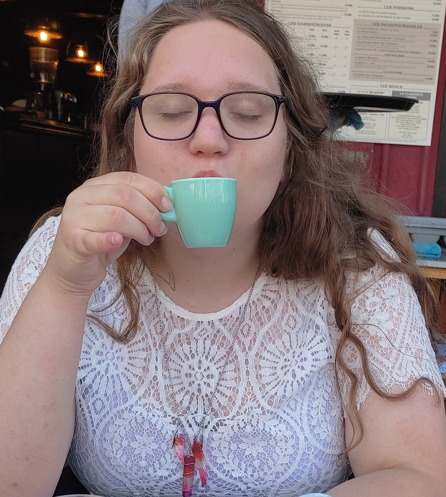

<h1 align="center"> Charlotte Thomas </h1>

## I, Me, Myself

 
 

 

 

### About Me
Hello! I'm Charlotte THOMAS, a 19y.o French girl, computer science and mathematics student in *prépa* preparing the *concours* of France's engineering schools.

### School
I spent the last two years in *prépa* in [Lycée Michel de Montaigne, Bordeaux](http://montaigne-bordeaux.fr) before that I prepared the French High School Diploma at [Lycée Gustave Eiffel, Bordeaux](https://www.eiffel-bordeaux.org/).

### Working experience
I spent a month working in the IT department of the French *Direction Générale des Finances Publiques* (which is somewhat equivalent to the IRS to be simple).

### Queer life
I'm Queer AF. I'm a transgender intersex girl, *straight* ~~unfortunately~~, based in France. Advocating for trans right and intersex right, I follow an intersectional feminism open to all, in support of all women. 

As you probably deduced from the badges. Yes. I like the trans flag. A lot.

On HRT for two years now, I legally changed my name to Charlotte Ophélie Margot, and gender to female, if you need help getting medical health care / starting a transition / have a transgender or intersex related question / ~~submit your application for BF~~ please email me at either one of these addresses:
* charlotte.sfiacademy@gmail.com
* contact@nwa2coco.fr

## Development
### Introduction
Even if I now focus on my studies in theoretical computer science and mathematics I used to develop a lot, and still do now.

### Active projects
My currently active projects are
* [AngryCAS](https://github.com/coco33920/AngryCAS) The most angry and cynical CAS ever. Written in OCaml using dune
* [The Baguette#](https://www.baguettesharp.fr) ecosystem : currently the interpreter is finished, being uploaded on the OPAM repositories. Written in OCaml using dune
  * The interpreter repository is [here](https://github.com/coco33920/ocaml-baguettesharp-interpreter)
  * The VSCode Extension repository is [here](https://github.com/coco33920/baguette-sharp-vscode)
  * The WebInterpreter (with js_of_ocaml) repository is [here](https://github.com/coco33920/baguette-sharp-vscode)
* [Stories](https://agh.nwa2coco.fr) A website to centralise my stories and web novels. Written in Markdown, powered by GH-Page
* [A Galactic HRT](https://agh.nwa2coco.fr#agh) My main Science-Fiction/Drama/Tragedy/Romance story in PDF/HTML, written in LaTeX converted to HTML later.
* [Wakatime Libreoffice](https://github.com/coco33920/wakatime-libreoffice) A WIP extension for LibreOffice to provides community support for [wakatime](https://wakatime.com) for LibreOffice/OpenOffice

### Old projects
These projects are either abandoned or archived, you can use them (most of them are under the MIT Licence, consider those without licences as CC0) but I do not provide any support whatsoever

* [Automatic Report System](https://github.com/sfi-region9/) a client-server ecosystem mostly written in Java to automate reports to a hierarchy composed of
  * [Automatic Report Server](https://github.com/sfi-region9/AutomaticReportServer) The server written in Java, powered by SparkJava
  * [Automatic Report Website](https://github.com/sfi-region9/ARS-Website) The new web-based client, written in Java, powered by Vaadin
  * [ARSAuth](https://github.com/sfi-region9/ARSAuth) The Authentification server providing tokens for the API.
* [KSPController](https://github.com/coco33920/KSPController) A Java based code (using kRPC mod and API) to connect to a kRPC server and control a rocket in Kerbal Space Program with components, interfacing with a Raspberry Pi Zero
* [AdafruitSeesawJava](https://github.com/coco33920/AdafruitSeesawJava) A Java Driver using I2C and Pi4J to interface with the Adafruit Seesaw Expander for Raspberry Pi
* [BaguetteSharp OG](https://github.com/coco33920/baguette-sharp) The Original Baguette# forked from Ikea# in GO, the new version is much better but this started everything.

## Writing
I recently started writing. Go check 
my [ScribbleHub](https://www.scribblehub.com/profile/49937/coco33920/) page or my stories [website](https://agh.nwa2coco.fr)